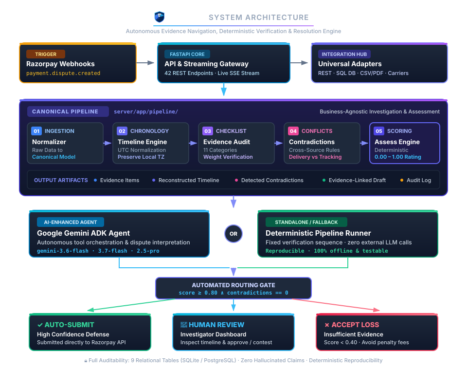
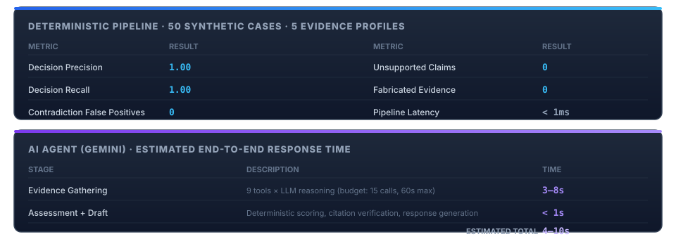

<div align="center">

  

  <p><strong>Risk Analysis &amp; Verification for Evidence Navigation</strong></p>
  <p><em>AI-powered chargeback investigation and evidence response system</em></p>
  <p>Built for the <a href="https://razorpay.com/">Razorpay Buildathon 2026</a> · Integrates with <a href="https://razorpay.com/docs/api/disputes/">Razorpay Disputes API</a></p>

  <p>
    
    
    
    
    
  </p>

</div>

---

## What It Does

When a customer files a **"Product Not Received"** chargeback, RAVEN automatically runs a structured investigation pipeline:

<div align="center">


</div>

| Stage | Focus | Operational Action |
|:---:|---|---|
| **01** | **Ingestion** | Receives the dispute via Razorpay webhook (`payment.dispute.created`) |
| **02** | **Evidence Gathering** | Gathers evidence across **11 source categories** (payment, order, shipping, delivery, auth, comms, refund, service, policy, device, other) |
| **03** | **Normalization** | Normalizes all raw provider data into a **canonical, business-agnostic schema** |
| **04** | **Timeline** | Builds a **chronological timeline** with full timezone handling (UTC + local preserved) |
| **05** | **Contradictions** | Cross-audits evidence using composable conflict detection rules |
| **06** | **Scoring** | Computes case strength via a **deterministic, reproducible** weighted assessment (0.00 – 1.00) |
| **07** | **Routing** | Routes high-confidence cases to **auto-submit**; uncertain cases to **human review** |
| **08** | **Streaming** | **Streams** investigation steps live to the React dashboard via Server-Sent Events |

> **Core Principle:** Every claim traces to a source record. The LLM is a tool in the pipeline — it never generates scores, fabricates evidence, or makes unsupported claims.

---

## Key Features

### Investigation Engine

| Feature | Description |
|---|---|
| **Evidence-first investigation** | Every important claim links to source records — zero fabrication, zero hallucination |
| **Contradiction detection** | Composable cross-source conflict rules (delivery vs. tracking, customer vs. support, refund double recovery, timeline anomalies) |
| **Deterministic scoring** | Weighted evidence checklist (0.0 – 1.0) — reproducible, explainable, methodology-versioned (`weighted_evidence_checklist_v1`) |
| **Evidence-linked responses** | Generated response drafts reference specific evidence items by ID — no unsupported claims |
| **Full audit trail** | Every action, tool call, state transition, and decision is recorded with traceable case IDs |

### AI Agent

| Feature | Description |
|---|---|
| **Dual-mode operation** | Works without an API key (fully deterministic); Google Gemini ADK enhances tool selection when configured |
| **Model picker** | Switch between **4 Gemini models** at runtime — 3.6 Flash (default), 2.5 Flash Lite, 3.7 Flash, 2.5 Pro |
| **Bounded authority** | Agent has read-only investigation tools. Scoring is always deterministic. Humans authorize consequential actions |
| **Streaming investigation** | Watch the agent's tool calls, reasoning steps, and evidence gathering in real-time via SSE |

### Platform

| Feature | Description |
|---|---|
| **Integrations hub** | Connect REST APIs, databases, file uploads (CSV/Excel/PDF), webhooks, and carrier APIs as evidence sources with visual field mapping |
| **Case simulator** | Generate realistic synthetic disputes from preset evidence profiles for testing and demos |
| **Settings dashboard** | Credential management with masked previews, live validation, and auto-pilot guardrail configuration |
| **Auto-submit routing** | High-confidence cases (score ≥ 0.80, 0 contradictions) bypass human review |
| **Human review dashboard** | Approve, reject, or escalate with full evidence panel, timeline, contradictions, and assessment gauge |
| **Idempotent operations** | Duplicate webhooks handled safely; re-investigation never creates duplicate evidence |

---

## Quick Start

### Prerequisites

- **Python 3.12+** and **Node.js 18+**
- *(Optional)* [Google Gemini API key](https://aistudio.google.com/apikey) for AI-enhanced investigation

### 1. Backend

```bash
cd server
cp .env.example .env              # Configure environment
pip install -e ".[dev]"           # Install dependencies
python -m data.seed               # Generate 50 synthetic cases
python -m uvicorn app.main:app --reload --port 8000
```

### 2. Frontend

```bash
cd web
npm install
npm run dev                       # → http://localhost:5173
```

### 3. Demo Mode (Quick)

```bash
cd server
python -m scripts.demo            # Seeds 8 cases + investigates all automatically
```

### 4. Enable AI Agent *(Optional)*

```bash
# Add to server/.env
RAVEN_GEMINI_API_KEY=your_key_here
RAVEN_AGENT_MODEL=gemini-3.6-flash    # Default — see model catalog below

# Install agent dependencies
cd server && pip install -e ".[agent]"
```

### 5. Docker

```bash
cd web && npm run build && cd ..
docker compose up --build         # → http://localhost:8000
```

---

## Architecture

<div align="center">



</div>

---

## Evaluation Results

The deterministic pipeline is validated against **50 synthetic cases** across 5 evidence profiles (strong defense, weak delivery, missing evidence, contradictory signals, edge cases). These cases were authored by the same team that built the system — perfect scores on an internal test set are expected, not impressive.

When the AI agent is enabled, it uses up to **9 evidence tools** with a budget of **15 tool calls** and a **60-second hard timeout** per investigation. The agent handles evidence gathering and reasoning; assessment, scoring, and response drafting are always deterministic regardless of which mode runs.

<div align="center">



</div>

```bash
cd server && python -m tests.evaluation.runner    # Reproduce locally
```

> The value is in having the framework itself — a reproducible benchmark that catches regressions when real dispute data replaces synthetic cases. See the [Evaluation Report](docs/evaluation-report.md) for full methodology and known limitations.

---

## API Overview

**42 REST endpoints** + SSE streaming across 9 route groups. Full interactive docs at [`http://localhost:8000/docs`](http://localhost:8000/docs).

| Module | Endpoints | Description |
|---|---|---|
| **Cases** | `GET/POST/DELETE /cases/*` | List, investigate, review, submit, batch ops (12 endpoints) |
| **Stream** | `GET /cases/{id}/investigate/stream` | Live SSE investigation stream |
| **Webhooks** | `POST /webhooks/razorpay` | Dispute event ingestion |
| **Metrics** | `GET /metrics/*` | Dashboard stats and breakdowns |
| **Models** | `GET /models/` | Available AI models catalog |
| **Simulator** | `GET/POST /simulator/*` | Case generation from presets (3 endpoints) |
| **Integrations** | `GET/POST/PUT/DELETE /integrations/*` | Data source management (15 endpoints) |
| **Settings** | `GET/POST/PUT /settings/*` | Credentials and guardrails (4 endpoints) |
| **System** | `GET /health` | Health check |

> **Interactive Documentation:** See the [API Reference](docs/api-reference.md) or visit `http://localhost:8000/docs` for interactive OpenAPI Swagger documentation.

---

## Testing

```bash
cd server

# Full test suite
python -m pytest tests/ -v                    # 330 tests

# Evaluation framework
python -m tests.evaluation.runner             # 50 annotated cases → precision/recall/F1

# Demo
python -m scripts.demo                        # Quick demo with 8 cases
```

**330 tests** covering:

| Category | What's Tested |
|---|---|
| Pipeline | Normalization, timeline builder, completeness checker, contradiction detector |
| Database | ORM models, state transitions, cascade deletes |
| Agent | ADK callbacks, agent factory, evidence tools |
| Adapters | REST, database, file, webhook, carrier connectors |
| Services | Integrations CRUD, simulator, case lifecycle |
| Robustness | Error paths, edge cases, diverse dispute types, dynamic checklists |
| API | Full endpoint integration tests |
| Golden | Stable expected outcomes for regression detection |

---

## Available Models

| Model | Tier | Latency | Capability Profile |
|---|---|:---:|---|
| **`gemini-3.6-flash`** | Free / Economy | ~1.5s | **Default** — optimal balance of speed, cost, and forensic reasoning |
| `gemini-2.5-flash-lite` | Budget | ~0.8s | **Fastest** — optimized for rapid, lightweight investigations |
| `gemini-3.7-flash` | Hybrid Reasoning | ~2.0s | **Adaptive** — enhanced reasoning for ambiguous claims |
| `gemini-2.5-pro` | Deep Reasoning | ~4.0s | **Comprehensive** — maximum depth for complex contradiction analysis |

> Switch models at runtime via the UI model picker or `RAVEN_AGENT_MODEL` environment variable. The system works fully without any model configured — the deterministic pipeline handles everything.

---

## Tech Stack

| Layer | Technology |
|---|---|
| **Backend** | Python 3.12 · FastAPI · SQLAlchemy 2.0 · Pydantic 2.0 |
| **Database** | SQLite (dev) / PostgreSQL (prod) — 9 tables |
| **Agent** | Google ADK · Gemini 3.6 Flash (optional, deterministic fallback) |
| **Frontend** | Vite · React 18 · Vanilla CSS · SSE streaming |
| **Integration** | Razorpay Disputes API · Webhooks · REST/DB/File adapters |
| **Testing** | pytest (330 tests) · 50-case evaluation framework |
| **Deployment** | Docker · Docker Compose |

---

## Documentation

| Document | Focus | Contents |
|---|---|---|
| [Architecture](docs/architecture.md) | System Design | Component layout, subsystem boundaries, data contracts |
| [Data Flow](docs/data-flow-diagram.md) | Pipeline Sequence | End-to-end investigation flow with Mermaid diagrams |
| [API Reference](docs/api-reference.md) | REST Interfaces | Complete specification for all 42 endpoints and SSE streams |
| [Configuration](docs/configuration.md) | Environment | Variables, Docker setup, CORS origins, model catalog |
| [Development Guide](docs/development-guide.md) | Engineering | Local setup, project tree, test commands, contribution |
| [Evidence Model](docs/canonical-evidence-model.md) | Data Schema | Canonical evidence specifications, 11 categories, 6 statuses |
| [Decision Engine](docs/decision-engine.md) | Scoring | Methodology, routing thresholds, step-by-step worked examples |
| [Razorpay Integration](docs/razorpay-integration.md) | Gateway | Webhook ingestion, API flows, idempotency guarantees |
| [Evaluation Report](docs/evaluation-report.md) | Benchmarks | 50-case test results, metrics, honest limitations |
| [Engineering Contract](AGENTS.md) | Standards | Immutable core truths, bounded authority, safety invariants |

---

## Design Principles

RAVEN is engineered under six permanent architectural invariants defined in [`AGENTS.md`](AGENTS.md):

1. **Evidence First** — The investigation pipeline is the core product; the LLM is an assistive tool within it, never the source of truth.
2. **Source Data Is the Authority** — Every claim traces deterministically to an immutable source record. The agent cannot invent, fabricate, or silently omit evidence.
3. **Honesty Over Blind Defense** — Missing, contradictory, or insufficient evidence is surfaced immediately to prevent unwarranted disputes and penalty fees.
4. **Business-Agnostic Core** — Provider-specific schemas (Razorpay, OMS, CRM) are normalized at the connector boundary. The reasoning engine operates strictly on canonical evidence.
5. **Bounded Authority & Safety** — RAVEN investigates and recommends. Autonomous execution requires explicit, scoped human authorization.
6. **Structured Protocol Over Free-Form Chat** — RAVEN is not a conversational chatbot. It executes a rigorous, auditable investigation protocol: *Investigate → Verify → Correlate → Explain → Recommend.*

---

<div align="center">

  

  <p><strong>RAVEN — Risk Analysis &amp; Verification for Evidence Navigation</strong></p>
  <p><em>Engineered as though a dispute investigator will rely on it under pressure, and another engineer will inherit it tomorrow.</em></p>

  <p>
    Built for the <strong>Razorpay Buildathon 2026</strong> · Integrated with the <a href="https://razorpay.com/docs/api/disputes/">Razorpay Disputes API</a>
  </p>

</div>
