# RAVEN Architecture

> Risk Analysis & Verification for Evidence Navigation

## System Overview

RAVEN is a chargeback investigation and evidence response system that integrates with Razorpay's Disputes API. When a customer files a "Product Not Received" dispute, RAVEN automatically:

1. **Receives** the dispute via webhook
2. **Gathers** evidence from payment, order, shipping, delivery, authentication, and communication sources
3. **Normalizes** all evidence into a canonical schema
4. **Builds** a chronological timeline
5. **Detects** contradictions between evidence sources
6. **Assesses** case strength with a reproducible deterministic score
7. **Generates** a structured response draft
8. **Routes** to auto-submit (strong cases) or human review (uncertain/contradictory cases)

## Architecture Diagram

```mermaid
flowchart LR
    %% Ingestion
    subgraph S1 ["1. Ingestion"]
        direction TB
        WH_IN["Razorpay Webhook<br/><code>payment.dispute.created</code>"]
        HANDLER["Webhook Handler"]
        WH_IN --> HANDLER
    end

    %% Investigation Core
    subgraph S2 ["2. Agent & Evidence Gathering"]
        direction TB
        AGENT["RAVEN Agent<br/>(Gemini ADK / Deterministic)"]
        
        subgraph SOURCES ["Data Sources (Tool Calls)"]
            direction TB
            MERCH["🏢 Merchant Systems<br/>• Order Management<br/>• Shipping Carrier<br/>• Customer Support"]
            RZP["💳 Razorpay APIs<br/>• Payments API<br/>• Orders API<br/>• Refunds API<br/>• Customers API"]
        end
        
        AGENT <--> SOURCES
    end

    %% Analysis Engine
    subgraph S3 ["3. Analysis & Verification"]
        direction TB
        TOOLS["Data + Analysis Tools<br/>• Normalizer<br/>• UTC Timeline<br/>• Contradictions"]
        STORE[("Evidence Store<br/>(SQLite / PostgreSQL)")]
        DECISION{"Decision Engine<br/>Weighted Score (0-1.0)"}
        
        TOOLS --> STORE --> DECISION
    end

    %% Decision & Action
    subgraph S4 ["4. Review & Submission"]
        direction TB
        AUTO["⚡ High Confidence<br/>(Score ≥ 0.80 & No Conflicts)"]
        HUMAN["👤 Dashboard UI<br/>(Human Analyst Review)"]
        RESP["Response Generator<br/>(Evidence Packet Draft)"]
        SUBMIT["💳 Razorpay Platform<br/>• Disputes API (PATCH contest)<br/>• Documents API (POST upload)"]
        
        AUTO --> RESP
        HUMAN -- "Approved" --> RESP
        RESP --> SUBMIT
    end

    %% Connections
    HANDLER --> AGENT
    AGENT --> TOOLS
    DECISION -- "Score ≥ 0.80" --> AUTO
    DECISION -- "Score < 0.80 or Conflicts" --> HUMAN

    %% Styling
    classDef default fill:#1e293b,stroke:#475569,stroke-width:1px,color:#f8fafc;
    classDef accent fill:#0f172a,stroke:#38bdf8,stroke-width:2px,color:#38bdf8;
    classDef decision fill:#311042,stroke:#c084fc,stroke-width:2px,color:#f3e8ff;
    classDef action fill:#064e3b,stroke:#34d399,stroke-width:2px,color:#ecfdf5;

    class HANDLER,AGENT,TOOLS accent;
    class DECISION decision;
    class RESP,SUBMIT,AUTO action;
```



```
                        ┌──────────────────────┐
                        │   Merchant Systems   │
                        │ ┌──────────────────┐ │
                        │ │ Order Management │ │
                        │ │ Shipping Provider│ │
                        │ │ Customer Support │ │
                        │ └──────────────────┘ │
                        └──────────┬───────────┘
                                   │
                    ┌──────────────┼──────────────────────────────────────┐
                    │              ▼          RAVEN Service               │
                    │  ┌────────────────┐                                │
                    │  │ Webhook Handler│◄── payment.dispute.created     │
                    │  └───────┬────────┘                                │
                    │          ▼                                          │
                    │  ┌────────────────┐                                │
                    │  │ RAVEN Agent    │  (Google ADK — model-agnostic) │
                    │  │ ┌────────────┐ │                                │
                    │  │ │ ADK Runner │ │  Model: configurable           │
                    │  │ └──────┬─────┘ │  Default: gemini-3.6-flash    │
                    │  └───────┬────────┘                                │
                    │          │ tool calls                               │
                    │          ▼                                          │
                    │  ┌────────────────────────────────────┐            │
                    │  │     SyntheticConnector (Demo)      │            │
                    │  │  ┌──────────┐  ┌───────────────┐  │            │
                    │  │  │ Payment  │  │ Shipping      │  │            │
                    │  │  │ Order    │  │ Delivery      │  │            │
                    │  │  │ Customer │  │ Auth          │  │            │
                    │  │  │ Refunds  │  │ Communication │  │            │
                    │  │  └──────────┘  └───────────────┘  │            │
                    │  │  Reads from data/synthetic/cases/  │            │
                    │  └──────────────┬─────────────────────┘            │
                    │                 ▼                                   │
                    │  ┌────────────────┐                                │
                    │  │  Normalizer    │  Raw data → Canonical Evidence │
                    │  └───────┬────────┘                                │
                    │          │                                          │
                    │   ┌──────┼──────┬──────────────┐                  │
                    │   ▼      ▼      ▼              ▼                  │
                    │ Timeline Compl. Contradiction  Decision            │
                    │ Builder  Check  Detector       Engine              │
                    │   │      │      │              │                  │
                    │   └──────┼──────┘              │                  │
                    │          │     ┌───────────────┘                  │
                    │          │     │                                   │
                    │          │  ┌──┴──────────┐    ┌──────────────┐   │
                    │          │  │ HIGH conf.  │───▶│ Response Gen │   │
                    │          │  │ (≥ 0.80)    │    └──────┬───────┘   │
                    │          │  └─────────────┘           │           │
                    │          │                            ▼           │
                    │          │  ┌─────────────┐   ┌──────────────┐   │
                    │          └─▶│ LOW/MEDIUM  │──▶│ Dashboard UI │   │
                    │             │ confidence  │   │ Human Review │   │
                    │             └─────────────┘   └──────────────┘   │
                    └──────────────────────────────────────────────────┘
                                                          │
                    ┌─────────────────────────────────────┼────────────┐
                    │            Razorpay Platform         │            │
                    │                                      ▼            │
                    │  Webhooks ──► payment.dispute.created             │
                    │                                                   │
                    │  PATCH /v1/disputes/:id/contest ──► Disputes API  │
                    │  POST  /v1/documents             ──► Documents    │
                    └──────────────────────────────────────────────────┘
```

### Demo Mode vs Production

```
                   DEMO (current)                    PRODUCTION
              ┌──────────────────┐            ┌──────────────────┐
              │SyntheticConnector│            │ RazorpayConnector│
              │                  │            │                  │
              │ Reads JSON files │            │ GET /v1/payments │
              │ from data/       │            │ GET /v1/orders   │
              │ synthetic/cases/ │            │ GET /v1/refunds  │
              │                  │            │ GET /v1/customers│
              │ 50 pre-built     │            │                  │
              │ test cases       │            │ + MerchantAPI    │
              └────────┬─────────┘            └────────┬─────────┘
                       │                               │
                       ▼                               ▼
              ┌──────────────────────────────────────────┐
              │     Same Normalizer → Same Pipeline      │
              │     Same Scoring → Same Routing          │
              │     (Business-agnostic core)             │
              └──────────────────────────────────────────┘
```

The investigation pipeline is **identical** in both modes.
Only the data source changes — the connector is swapped at the boundary.

## Key Components

### Agent Layer (`app/agent/`)

- **`agent.py`**: ADK `Agent` definition — model-agnostic, configurable via `RAVEN_AGENT_MODEL`
- **`factory.py`**: Agent factory — creates ADK agent or deterministic fallback based on configuration
- **`callbacks.py`**: ADK callback handlers for streaming and observability
- **`tools.py`**: Investigation tools — ADK auto-generates schemas from type hints + docstrings

The LLM (default: `gemini-3.6-flash`) decides which tools to call and in what order.
If no API key is set or ADK fails, the deterministic pipeline handles everything.

### Connectors (`app/connectors/`)

- **SyntheticConnector** (Demo): Reads from generated JSON case files
- **RazorpayConnector** (Production): Parses Razorpay webhook events and API responses
- **BaseAdapter**: Abstract base for all data source adapters
- **RestAdapter**: REST API integration adapter
- **DatabaseAdapter**: Database integration adapter
- **FileAdapter**: File upload (CSV, Excel, PDF) adapter
- **WebhookAdapter**: Webhook receiver adapter
- **CarrierAdapter**: Shipping carrier tracking adapter
- **AdapterRegistry**: Discovers and manages available adapter types
- **Quarantine**: Holds data that fails boundary validation

### Normalizer (`app/pipeline/ingest.py`)

Transforms raw data into canonical `Evidence` objects with:
- `evidence_id`, `case_id`, `category`, `source_system`
- `status`: available | missing | unverified | not_applicable | ingestion_error
- `reliability`: high | medium | low | unknown
- `event_time`, `content`, `summary`

### Analysis Pipeline (`app/pipeline/analysis.py`)

1. **Timeline Builder**: Chronological events with timezone handling
2. **Completeness Checker**: Weighted checklist of required evidence
3. **Contradiction Detector**: Cross-source conflict identification

### Decision Engine (`app/pipeline/assess.py`)

Produces an `Assessment` with:
- **Score** (0.0–1.0): Weighted evidence completeness
- **Strength**: high | medium | low
- **Recommendation**: contest | human_review | accept_loss
- **Auto-submit eligibility**: Only when score >= 0.80 AND no contradictions

**Always deterministic. Never LLM-generated.**

### Response Generator

Deterministic template-based response draft linking each claim to source evidence. Integrated into the pipeline.

### Services (`app/services/`)

- **CaseService**: Case lifecycle management — investigate, review, submit
- **IntegrationService**: CRUD, test, sync, and field mapping for data source integrations
- **SimulatorService**: Generate realistic dispute cases from preset profiles
- **ModelService**: Available AI model discovery and management

### API Layer (`app/api/`)

42 REST endpoints + SSE streaming across three route modules. See `http://localhost:8000/docs` for OpenAPI spec.

### Dashboard (`web/`)

Vite + React application with:
- Stat card dashboard with status breakdown
- Filterable case list with queue and history modes
- Case detail with evidence panel, timeline, contradictions, assessment gauge
- Live SSE investigation streaming
- Human review actions (approve/reject/escalate/submit)
- Case simulator modal for generating test disputes
- Integrations hub with wizard, field mapping editor, and file uploader
- Settings page with credential management and guardrail configuration
- Analytics page
- Model picker for switching AI models
- Responsive design with collapsible sidebar and mobile navbar

## Data Flow

```
Webhook Payload (or demo seed)
    |
    v
CaseModel (SQLite) <-- created, status=created
    |
    v
SyntheticConnector fetches data (payment, order, shipping, delivery, auth, comms)
    |
    v
Normalizer produces 7 Evidence items
    |
    v
Timeline: sorted chronological events
Completeness: weighted checklist
Contradictions: cross-source conflicts
    |
    v
Decision Engine: score + recommendation (deterministic)
    |
    v
Response Generator: evidence-linked draft
    |
    v
CaseModel updated (status=approved or under_review)
Evidence/Timeline/Contradictions stored in DB
Audit trail recorded
```

## Database Schema

| Table | Purpose |
|---|---|
| `cases` | Case lifecycle, assessment data, review state |
| `evidence_items` | Normalized evidence per case |
| `contradictions` | Detected conflicts per case |
| `timeline_events` | Chronological events per case |
| `audit_logs` | All state transitions and actions |
| `agent_runs` | Investigation execution records |
| `integrations` | Reusable data source integration configurations |
| `integration_field_mappings` | Source-to-canonical field mapping per integration |
| `system_settings` | Key-value store for persistent system configuration |

## Technology Stack

| Layer | Technology |
|---|---|
| Backend | Python 3.12, FastAPI, SQLAlchemy 2.0 |
| Database | SQLite (dev) / PostgreSQL (prod) |
| Agent | Google ADK (model-agnostic) |
| Default Model | Gemini 3.6 Flash (configurable via env) |
| Frontend | Vite, React, vanilla CSS |
| Integration | Razorpay Disputes API |
| Testing | pytest (330 tests), 50-case evaluation |

## Testing

```bash
# Unit + Integration tests (330 tests)
pytest tests/ -v

# Evaluation (50 annotated cases)
python -m tests.evaluation.runner

# Demo mode
python -m scripts.demo
```

## Authority Levels

| Level | Action | Authorization |
|---|---|---|
| 0 | Collect evidence | Automatic |
| 1 | Classify, score, detect contradictions | Automatic |
| 2 | Generate response draft | Automatic |
| 3 | Recommend contest/accept/review | Automatic |
| 4 | Submit to Razorpay | Requires human approval |
