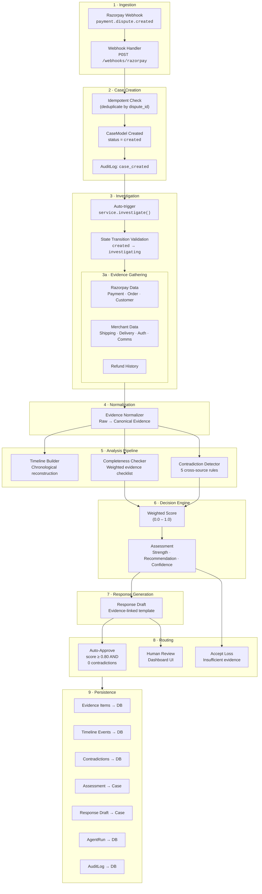

# RAVEN Data Flow

> Complete data flow documentation for the chargeback investigation pipeline.

---

## End-to-End Flow Overview



---

## 1. Ingestion — Webhook Reception

**Entry point:** `POST /webhooks/razorpay`

**Source file:** [`routes.py`](file:///c:/Users/gowth/Desktop/raven/server/app/api/routes.py)

```
Razorpay Platform
    │
    │  HTTP POST — JSON payload
    │  Event: payment.dispute.created
    │
    ▼
┌────────────────────────────────────────────────────────────┐
│  Webhook Handler                                           │
│                                                            │
│  1. Parse JSON body                                        │
│  2. Extract event type                                     │
│  3. Extract dispute entity                                 │
│  4. Parse timestamps (epoch → UTC datetime)                │
│  5. Route by event type:                                   │
│     • payment.dispute.created → Create + Investigate       │
│     • payment.dispute.action_required → Re-investigate     │
│     • payment.dispute.won → Update outcome                 │
│     • payment.dispute.lost → Update outcome                │
│     • Other → Ignore                                       │
└────────────────────────────────────────────────────────────┘
```

### Webhook Payload Structure

```json
{
  "event": "payment.dispute.created",
  "payload": {
    "dispute": {
      "entity": {
        "id": "disp_AYz...",
        "payment_id": "pay_BK7...",
        "amount": 849900,
        "currency": "INR",
        "reason_code": "chargeback",
        "reason_description": "Product not received",
        "phase": "chargeback",
        "status": "open",
        "respond_by_date": 1735689600,
        "created_at": 1735603200
      }
    }
  }
}
```

### Fields Extracted

| Field | Source | Transform |
|---|---|---|
| `dispute_id` | `entity.id` | Direct |
| `payment_id` | `entity.payment_id` | Direct |
| `amount` | `entity.amount` | Integer (paise) |
| `currency` | `entity.currency` | Default: `INR` |
| `reason_code` | `entity.reason_code` | Direct |
| `respond_by` | `entity.respond_by_date` | Epoch → UTC datetime |
| `created_at` | `entity.created_at` | Epoch → UTC datetime |

---

## 2. Case Creation

**Source file:** [`case_service.py`](file:///c:/Users/gowth/Desktop/raven/server/app/services/case_service.py)

```
Parsed Webhook Data
    │
    ▼
┌────────────────────────────────────────────────────────────┐
│  CaseService.create_from_webhook()                         │
│                                                            │
│  1. Idempotency check: query by rzp_dispute_id             │
│     └─ If exists → return existing case (no duplicate)     │
│  2. Generate case ID: CASE-{sequential_number:05d}         │
│  3. Create CaseModel with all dispute metadata             │
│  4. Insert AuditLog: "case_created"                        │
│  5. Commit to database                                     │
│  6. Return CaseModel                                       │
└────────────────────────────────────────────────────────────┘
```

### CaseModel State After Creation

```
id:              "CASE-00001"
status:          "created"
dispute_reason:  "product_not_received"
rzp_dispute_id:  "disp_AYz..."
rzp_payment_id:  "pay_BK7..."
amount:          849900
respond_by:      2025-01-01T00:00:00Z
```

---

## 3. Investigation Pipeline

**Source files:**
- [`case_service.py`](file:///c:/Users/gowth/Desktop/raven/server/app/services/case_service.py) — orchestration
- [`runner.py`](file:///c:/Users/gowth/Desktop/raven/server/app/pipeline/runner.py) — deterministic runner
- [`agent.py`](file:///c:/Users/gowth/Desktop/raven/server/app/agent/agent.py) — streaming orchestrator (SSE)

### Agent Module Structure

```
server/app/agent/
├── tools.py       ← 9 evidence-gathering tool functions + EVIDENCE_TOOLS registry
├── callbacks.py   ← before_tool_callback (budget) + after_tool_callback (evidence/audit)
├── factory.py     ← create_investigation_agent() with output_schema, callbacks, temperature
└── agent.py       ← InvestigationAgent streaming orchestrator (ADK + deterministic)
```

### Two Investigation Modes

```
                ┌─────────────────────┐
                │ Is Gemini API Key   │
                │ configured?         │
                └──────┬──────────────┘
                       │
              ┌────────┴────────┐
              │                 │
         YES  ▼            NO  ▼
    ┌──────────────┐   ┌──────────────┐
    │ ADK Agent    │   │ Deterministic│
    │              │   │ Pipeline     │
    │ LLM decides  │   │              │
    │ tool order   │   │ Fixed order: │
    │ via function  │   │ all tools    │
    │ calling      │   │ sequentially │
    │              │   │              │
    │ ADK features:│   │ Always works │
    │ • output_    │   │ 100% repro-  │
    │   schema     │   │ ducible      │
    │ • callbacks  │   │              │
    │ • session    │   │              │
    │   state      │   │              │
    └──────┬───────┘   └──────┬───────┘
           │                  │
           │   On failure     │
           ├──────────────────┘
           ▼
    ┌──────────────┐
    │ Deterministic│    ← SCORING IS ALWAYS DETERMINISTIC
    │ Assessment   │       regardless of investigation mode
    └──────────────┘
```

### ADK Agent Data Flow (ADK Mode)

```
┌──────────────────────────────────────────────────────────────┐
│  ADK Session State                                           │
│                                                              │
│  ┌─────────────────┐                                         │
│  │ Budget State    │ ← Initialized by orchestrator           │
│  │ calls_used: 0   │   Enforced by before_tool_callback      │
│  │ max_calls: 15   │                                         │
│  │ start_time: ... │                                         │
│  └─────────────────┘                                         │
│                                                              │
│  ┌─────────────────┐                                         │
│  │ gathered_       │ ← Accumulated by after_tool_callback    │
│  │ evidence: []    │   Read by assessment pipeline           │
│  └─────────────────┘   (no duplicate connector fetch)        │
│                                                              │
│  ┌─────────────────┐                                         │
│  │ investigation_  │ ← Written by output_schema              │
│  │ output: {...}   │   (InvestigationOutput Pydantic model)  │
│  └─────────────────┘   Replaces old _investigation_outputs   │
│                                                              │
│  ┌─────────────────┐                                         │
│  │ audit_log: []   │ ← Appended by after_tool_callback       │
│  └─────────────────┘   Tool name, args, duration, errors     │
└──────────────────────────────────────────────────────────────┘
```

### Callback Flow

```
Agent decides to call tool
       │
       ▼
before_tool_callback
  ├── Budget check (call count + time)
  ├── WITHIN budget → return None (allow)
  └── EXCEEDED → return error dict (block tool, agent sees budget message)
       │
       ▼ (if allowed)
Tool executes (e.g., get_delivery_evidence)
       │
       ▼
after_tool_callback
  ├── Accumulate evidence dicts into session.state["gathered_evidence"]
  ├── Append audit entry with timing + error flag
  └── Return tool response to agent
```

### State Transitions During Investigation

```
CREATED ──→ INVESTIGATING ──→ (one of):
                │
                ├──→ APPROVED       (score ≥ 0.80, 0 contradictions)
                ├──→ UNDER_REVIEW   (contradictions or uncertain)
                ├──→ DRAFT_READY    (no human review needed)
                ├──→ EVIDENCE_GATHERED  (no assessment produced)
                │
                └──→ CREATED (reverted on error)
```

### 3a. Evidence Gathering

**Source files:**
- [`synthetic.py`](file:///c:/Users/gowth/Desktop/raven/server/app/connectors/synthetic.py) — demo connector
- [`tools.py`](file:///c:/Users/gowth/Desktop/raven/server/app/agent/tools.py) — 9 evidence-gathering tool functions

```
┌──────────────────────────────────────────────────────────────┐
│  SyntheticConnector (Demo Mode)                              │
│                                                              │
│  Reads from: data/synthetic/cases/{case_id}.json             │
│                                                              │
│  ┌──────────────┐  ┌───────────────┐  ┌──────────────────┐  │
│  │ Razorpay Data│  │ Merchant Data │  │ Expected Outcome │  │
│  │              │  │               │  │ (Ground Truth)   │  │
│  │ • dispute    │  │ • shipping    │  │                  │  │
│  │ • payment    │  │ • delivery    │  │ For evaluation   │  │
│  │ • order      │  │ • auth        │  │ only — never     │  │
│  │ • customer   │  │ • comms       │  │ used in pipeline │  │
│  │              │  │ • refunds     │  │                  │  │
│  └──────┬───────┘  └───────┬───────┘  └──────────────────┘  │
│         │                  │                                  │
└─────────┼──────────────────┼──────────────────────────────────┘
          │                  │
          ▼                  ▼
    7 data sources → 7 canonical Evidence items
```

### Agent Tool Call Sequence (Deterministic Mode)

| Step | Tool | Sources | Output |
|---|---|---|---|
| 1 | `get_transaction` | Razorpay Payment + Order | Payment evidence, Order evidence |
| 2 | `get_delivery_evidence` | Merchant Shipping + Delivery | Shipping evidence, Delivery evidence |
| 3 | `get_refund_history` | Merchant Refunds | Refund evidence |
| 4 | `get_authentication_events` | Merchant Auth | Authentication evidence |
| 5 | `get_customer_communications` | Merchant CRM | Communication evidence |
| 6 | `detect_contradictions` | All evidence | Contradiction list |
| 7 | `assess_case` | Checklist + Contradictions | Assessment |

---

## 4. Evidence Normalization

**Source file:** [`ingest.py`](file:///c:/Users/gowth/Desktop/raven/server/app/pipeline/ingest.py)

The normalizer is **THE boundary** where business-specific data becomes business-agnostic canonical evidence.

```
┌──────────────────────────────────────────────────────────────┐
│  NORMALIZER — The Boundary                                   │
│                                                              │
│  Input: Raw dicts from connectors (business-specific)        │
│  Output: Evidence objects (canonical, business-agnostic)     │
│                                                              │
│  ┌──────────────────┐    ┌───────────────────────────────┐   │
│  │ Razorpay Payment │───▶│ Evidence(category=PAYMENT)    │   │
│  │ {id, amount,     │    │ source: "razorpay"            │   │
│  │  method, card}   │    │ content: {amount, method, …}  │   │
│  └──────────────────┘    └───────────────────────────────┘   │
│                                                              │
│  ┌──────────────────┐    ┌───────────────────────────────┐   │
│  │ Merchant Delivery│───▶│ Evidence(category=DELIVERY)   │   │
│  │ {delivered_at,   │    │ source: "merchant_delivery"   │   │
│  │  signed_by,      │    │ status: available/unverified  │   │
│  │  proof_type}     │    │ reliability: high/medium/low  │   │
│  └──────────────────┘    └───────────────────────────────┘   │
│                                                              │
│  If data is NULL → Evidence(status=MISSING)                  │
│  If data is empty → Evidence(status=NOT_APPLICABLE)          │
└──────────────────────────────────────────────────────────────┘
```

### Normalizer Functions

| Function | Input Source | Evidence Category | Key Logic |
|---|---|---|---|
| `normalize_razorpay_payment` | Razorpay Payment API | `PAYMENT` | Extracts card details, amount, status |
| `normalize_razorpay_order` | Razorpay Order API | `ORDER` | Extracts receipt, item, amount from notes |
| `normalize_razorpay_refunds` | Razorpay Refunds API | `REFUND` | Aggregates refund count + total; `NOT_APPLICABLE` if empty |
| `normalize_shipping` | Merchant Shipping | `SHIPPING` | Carrier, tracking ID, status; `MISSING` if null |
| `normalize_delivery` | Merchant Delivery | `DELIVERY` | Signed delivery → `AVAILABLE`; left-at-door → `UNVERIFIED`; null → `MISSING` |
| `normalize_auth` | Merchant Auth | `AUTHENTICATION` | OTP verified → `AVAILABLE`; not verified → `UNVERIFIED` |
| `normalize_communications` | Merchant CRM | `COMMUNICATION` | Aggregates tickets; `NOT_APPLICABLE` if empty |

### Delivery Evidence — Reliability Determination

```
Has signature?
    │
    ├── YES → status: AVAILABLE, reliability: HIGH
    │
    └── NO
        │
        ├── proof_type: "left_at_door" → status: UNVERIFIED, reliability: MEDIUM
        ├── proof_type: "mailbox"      → status: UNVERIFIED, reliability: MEDIUM
        └── other/unknown              → status: UNVERIFIED, reliability: LOW
```

---

## 5. Analysis Pipeline

Three independent analysis passes run on the normalized evidence:

```
Canonical Evidence (7 items)
    │
    ├──────────────────┬──────────────────┐
    ▼                  ▼                  ▼
┌──────────┐   ┌──────────────┐   ┌──────────────┐
│ Timeline │   │ Completeness │   │Contradiction │
│ Builder  │   │ Checker      │   │ Detector     │
└────┬─────┘   └──────┬───────┘   └──────┬───────┘
     │                │                   │
     ▼                ▼                   ▼
Timeline Events   Checklist + Missing  Contradictions
```

### 5a. Timeline Builder

**Source file:** [`analysis.py`](file:///c:/Users/gowth/Desktop/raven/server/app/pipeline/analysis.py)

- Converts evidence items with timestamps into chronological events
- Skips evidence without `event_time_utc` (never invents timestamps)
- Skips `MISSING` / `NOT_APPLICABLE` evidence
- Preserves original timezone and flags uncertain timezones
- Each event links back to source evidence via `source_evidence_id`

### 5b. Completeness Checker

**Source file:** [`analysis.py`](file:///c:/Users/gowth/Desktop/raven/server/app/pipeline/analysis.py)

Produces a **weighted checklist** for `PRODUCT_NOT_RECEIVED`:

| Category | Label | Required | Weight | Impact |
|---|---|---|---|---|
| `payment` | Payment confirmation | ✅ | 0.15 | Core transaction proof |
| `order` | Order details | ✅ | 0.10 | Establishes purchase |
| `shipping` | Shipping dispatched | ✅ | 0.15 | Shows fulfillment |
| `delivery` | Delivery confirmation | ✅ | **0.30** | **Highest — delivery proof is king** |
| `authentication` | Authentication (OTP/3DS) | ❌ | 0.15 | Establishes cardholder intent |
| `communication` | Customer communication | ❌ | 0.10 | Contextual support |
| `refund` | Refund history | ❌ | 0.05 | Double recovery check |

### 5c. Contradiction Detector

**Source file:** [`analysis.py`](file:///c:/Users/gowth/Desktop/raven/server/app/pipeline/analysis.py)

5 rules for `PRODUCT_NOT_RECEIVED`:

| Rule | Compares | Conflict | Impact |
|---|---|---|---|
| 1 | Delivery vs Shipping status | Delivered but carrier says `returned_to_sender` | **HIGH** |
| 2 | Customer claim vs Support logs | Filed "not received" but support shows confirmed receipt | **HIGH** |
| 3 | Delivery date vs Dispute date | Delivery timestamp AFTER dispute opened | **HIGH** |
| 4 | Refund existence | Refund already processed → double recovery risk | **MEDIUM** |
| 5 | Timeline anomaly | Delivery timestamp BEFORE order (timezone error) | **MEDIUM** |

---

## 6. Decision Engine

**Source file:** [`assess.py`](file:///c:/Users/gowth/Desktop/raven/server/app/pipeline/assess.py)

### Scoring Methodology: `weighted_evidence_checklist_v1`

```
score = Σ(weight × status_multiplier) / Σ(weight)
        ─────────────────────────────────────────
        for applicable items only
```

### Status Multipliers

| Status | Multiplier | Meaning |
|---|---|---|
| `available` | **1.0** | Evidence found and verified |
| `unverified` | **0.5** | Evidence exists, not independently verified |
| `missing` | **0.0** | Expected evidence not found |
| `conflicting` | **-0.3** | Sources disagree (penalizes score) |
| `not_applicable` | excluded | Not relevant to this case |

### Routing Thresholds

```
Score ≥ 0.80 AND 0 contradictions  ──→  AUTO-SUBMIT (CONTEST)
                                         confidence: HIGH
                                         human_review: NO

Score ≥ 0.80 AND contradictions > 0 ──→  HUMAN_REVIEW
                                         confidence: MEDIUM

Score ≥ 0.60                        ──→  HUMAN_REVIEW
                                         confidence: MEDIUM

Score ≥ 0.40                        ──→  HUMAN_REVIEW
                                         confidence: LOW

Score < 0.40 AND missing evidence   ──→  ACCEPT_LOSS
                                         confidence: HIGH (that evidence is insufficient)

Score < 0.40 AND no missing         ──→  ESCALATE
                                         confidence: LOW
```

### Example Score Calculation

Strong case (all evidence available):

```
Payment:        0.15 × 1.0 = 0.150
Order:          0.10 × 1.0 = 0.100
Shipping:       0.15 × 1.0 = 0.150
Delivery:       0.30 × 1.0 = 0.300   ← highest weight
Authentication: 0.15 × 1.0 = 0.150
Communication:  0.10 × 1.0 = 0.100
Refund:         0.05 × 1.0 = 0.050
─────────────────────────────────
Total:          1.000 / 1.000 = 1.00  → AUTO-SUBMIT
```

Weak case (delivery unverified, missing comms):

```
Payment:        0.15 × 1.0 = 0.150
Order:          0.10 × 1.0 = 0.100
Shipping:       0.15 × 1.0 = 0.150
Delivery:       0.30 × 0.5 = 0.150   ← unverified: half credit
Authentication: 0.15 × 1.0 = 0.150
Communication:  0.10 × 0.0 = 0.000   ← missing
Refund:         0.05 × 1.0 = 0.050
─────────────────────────────────
Total:          0.750 / 1.000 = 0.75  → HUMAN_REVIEW
```

---

## 7. Response Generation

**Source file:** [`assess.py`](file:///c:/Users/gowth/Desktop/raven/server/app/pipeline/assess.py)

Template-based (no LLM). Only generates when recommendation is `CONTEST` or `HUMAN_REVIEW`.

```
┌────────────────────────────────────────────────────────────┐
│  Response Draft Structure                                  │
│                                                            │
│  1. OPENING:     Contest statement                         │
│  2. PAYMENT:     Amount, method, card details              │
│  3. ORDER:       Receipt, item description                 │
│  4. SHIPPING:    Carrier, tracking number, status          │
│  5. DELIVERY:    Date, signature, proof type, photo        │
│  6. AUTH:        OTP/3DS verification, device, IP          │
│  7. COMMS:       Support ticket summaries                  │
│  8. TIMELINE:    Chronological event list                  │
│  9. CLOSING:     Evidence-based conclusion                 │
│                                                            │
│  Each section is ONLY included if evidence is AVAILABLE.   │
│  Missing evidence → section omitted (never fabricated).    │
└────────────────────────────────────────────────────────────┘
```

---

## 8. Persistence — What Gets Saved

**Source file:** [`case_service.py`](file:///c:/Users/gowth/Desktop/raven/server/app/services/case_service.py#L158-L277)

After investigation completes, the following are persisted:

```
┌────────────────────────────────────────────────────────────┐
│  Database (SQLite / PostgreSQL)                            │
│                                                            │
│  cases                                                     │
│  ├── assessment_score, case_strength, recommendation       │
│  ├── confidence, assessment_data (JSON)                    │
│  ├── response_draft, response_evidence_ids                 │
│  ├── status (updated based on routing)                     │
│  └── investigation_completed_at                            │
│                                                            │
│  evidence_items (cleared + re-inserted on re-investigation)│
│  ├── 7 items per case (one per evidence category)          │
│  └── each with: category, status, source, content, summary│
│                                                            │
│  contradictions (cleared + re-inserted)                    │
│  ├── 0-N per case                                          │
│  └── each links two evidence items with impact + desc      │
│                                                            │
│  timeline_events (cleared + re-inserted)                   │
│  ├── chronological events with UTC timestamps              │
│  └── each links back to source evidence                    │
│                                                            │
│  agent_runs (appended, never cleared)                      │
│  └── one record per investigation attempt                  │
│                                                            │
│  audit_logs (appended, never cleared)                      │
│  └── "investigation_completed" with full metadata          │
└────────────────────────────────────────────────────────────┘
```

### Re-Investigation Safety

- Evidence, contradictions, and timeline are **cleared and re-inserted** (no duplicates)
- Agent runs and audit logs are **appended** (full history preserved)
- Previously gathered evidence is replaced with fresh results

---

## 9. Human Review & Submission

```
┌───────────────────────────────────────────────────────────┐
│  Authority Levels                                         │
│                                                           │
│  Level 0 · READ      Collect evidence        Automatic   │
│  Level 1 · ANALYZE   Score, classify, detect  Automatic   │
│  Level 2 · DRAFT     Generate response       Automatic   │
│  Level 3 · RECOMMEND Contest/accept/review   Automatic   │
│  Level 4 · EXECUTE   Submit to Razorpay      HUMAN ONLY  │
└───────────────────────────────────────────────────────────┘
```

### Review Flow

```
POST /cases/{id}/review
    │
    ├── decision: "approve"  → status: APPROVED → eligible for submit
    ├── decision: "reject"   → status: REJECTED → case closed
    └── decision: "escalate" → status: ESCALATED → senior review
```

### Submission Flow

```
POST /cases/{id}/submit
    │
    ├── Requires: status == APPROVED
    ├── Requires: confirmed == true
    │
    ├── MVP: Simulates submission, updates status to SUBMITTED
    │
    └── Production (future):
        ├── POST /v1/documents — Upload evidence files
        └── PATCH /v1/disputes/{id}/contest — Contest dispute
```

---

## 10. SSE Live Streaming

**Source file:** [`routes.py`](file:///c:/Users/gowth/Desktop/raven/server/app/api/routes.py)

The streaming endpoint provides real-time investigation events:

```
GET /cases/{case_id}/investigate/stream

Client (EventSource) ←── Server (SSE)

Events emitted:
    step          │ Tool being called (step N of 7)
    evidence      │ Evidence item discovered
    thinking      │ Agent reasoning message
    contradiction │ Conflict detected
    result        │ Final assessment (score, recommendation)
    error         │ Error occurred
    done          │ Investigation complete
```

### Event Flow (Deterministic Mode)

```
step:1 → get_transaction
  evidence: payment (available)
  evidence: order (available)
  thinking: "Payment and order data retrieved..."

step:2 → get_delivery_evidence
  evidence: shipping (available)
  evidence: delivery (available|missing|unverified)
  thinking: "Delivery confirmed|WARNING: No delivery..."

step:3 → get_refund_history
  evidence: refund (available|not_applicable)

step:4 → get_authentication_events
  evidence: authentication (available|unverified)

step:5 → get_customer_communications
  evidence: communication (available|not_applicable)
  thinking: "All evidence gathered. Running analysis..."

step:6 → detect_contradictions
  contradiction: (if any detected)
  thinking: "Found N contradiction(s)|No contradictions..."

step:7 → assess_case
  result: {score, strength, recommendation, ...}
  thinking: "Investigation complete. Score: 0.XX..."

done: {case_id, mode, result}
```
